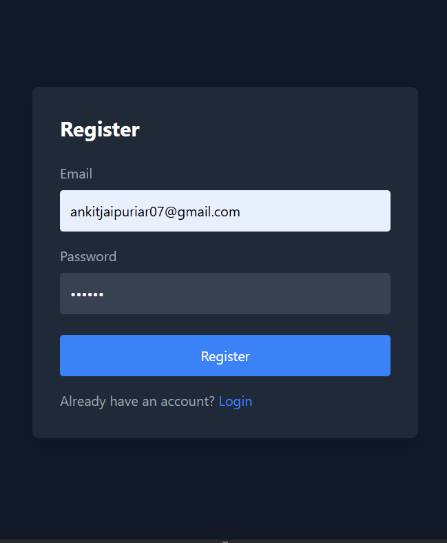
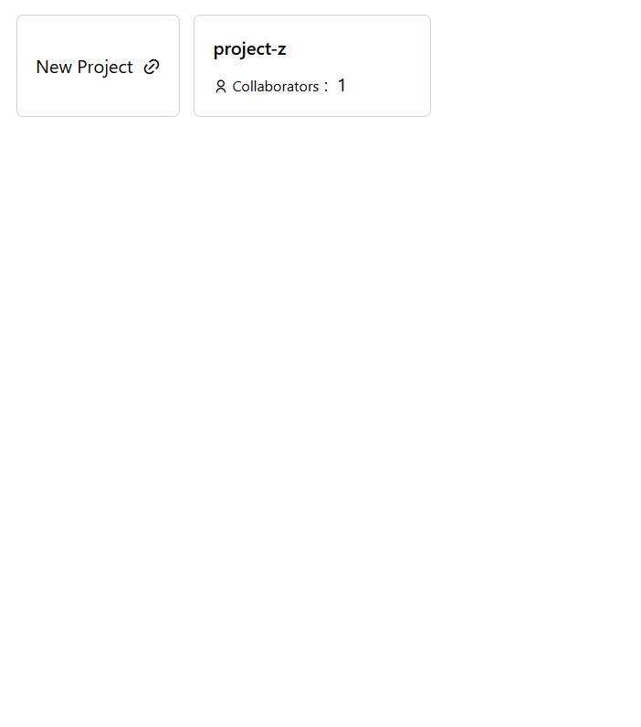
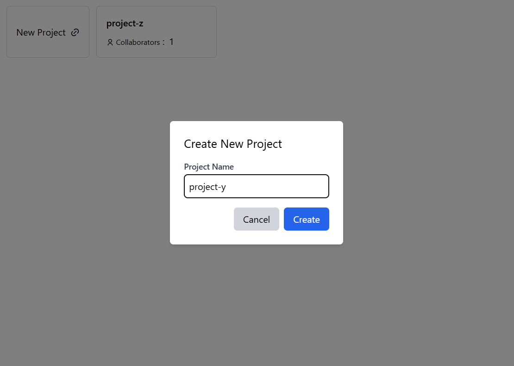
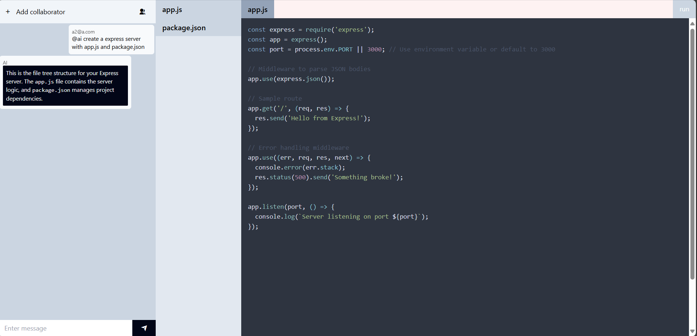
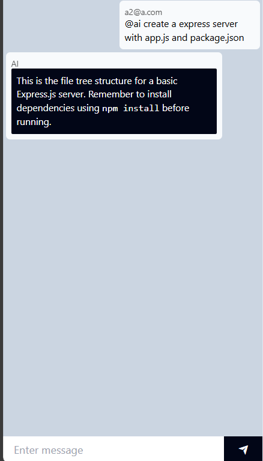
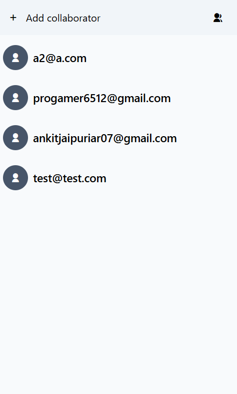
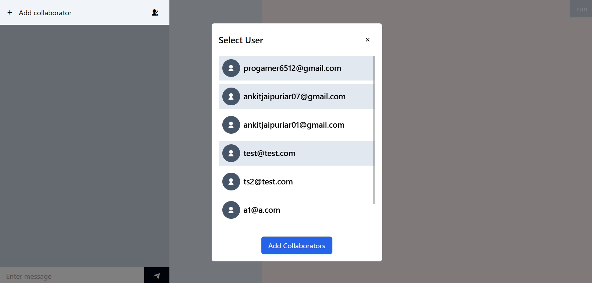
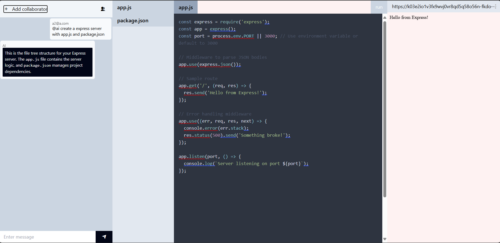
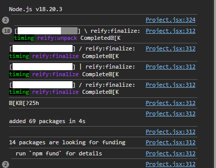

# AIWorkspace

AIWorkspace is a collaborative platform that enables users to create and manage projects, collaborate with team members, chat, and utilize AI capabilities for code generation and execution. This README provides an overview of the project and guides users on how to set up and use AIWorkspace effectively.

## Features

- **Project Management:**
  - Create and manage multiple projects.
  - Add collaborators to projects for seamless teamwork.

- **Real-Time Collaboration:**
  - Chat with collaborators within the project.
  - Mention collaborators or AI using "@" (e.g., `@ai` to interact with the AI).

- **AI Integration:**
  - Chat with the AI to get assistance.
  - Generate files using AI in the file explorer tab.

- **In-Browser Code Execution:**
  - View and edit code files directly in the browser.
  - Run code within the browser environment.

## Getting Started

### Prerequisites

- A modern web browser.
- An active internet connection.
- (Optional) A GitHub account to host the project repository.

### Installation

1. Clone the repository:
   ```bash
   git clone https://github.com/yourusername/aiworkspace.git
   ```
2. Navigate to the project directory:
   ```bash
   cd aiworkspace
   ```
3. Install dependencies:
   ```bash
   npm install
   ```
4. Start the development server:
   ```bash
   npm start
   ```
5. Open the application in your browser at `http://localhost:3000`.

### Screenshots

#### 1. Register


_The interfaces for registering new users._

#### 2. Project Dashboard and Create Project



_The central hub where users can create and manage projects._

#### 3. Project Page and Chat Section



_Viewing the project details and team communication interface._

#### 4. Member List and Add Collaborators



_Managing project members and adding collaborators._


#### 5. Run and Compilation



_Showcasing the process of running and compiling code._


### Usage

1. **Creating a Project:**
   - Navigate to the project dashboard.
   - Click on the "Create Project" button and fill out the necessary details.

2. **Adding Collaborators:**
   - Open the project settings.
   - Add collaborators using their email or username.

3. **Chatting and Collaborating:**
   - Use the chat interface to communicate.
   - Mention the AI (`@ai`) for assistance.

4. **File Management and Execution:**
   - Use the file explorer to create, edit, and manage files.
   - Click the "Run" button to execute code directly in the browser.

## Contributing

We welcome contributions! Please follow these steps:

1. Fork the repository.
2. Create a new branch for your feature/bug fix:
   ```bash
   git checkout -b feature-name
   ```
3. Commit your changes:
   ```bash
   git commit -m "Add new feature"
   ```
4. Push the changes to your fork:
   ```bash
   git push origin feature-name
   ```
5. Open a pull request.
